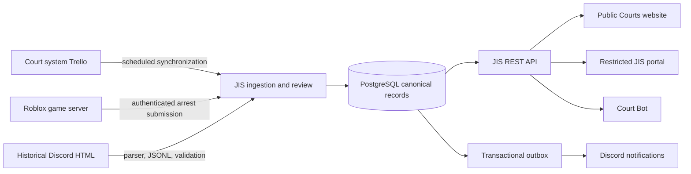
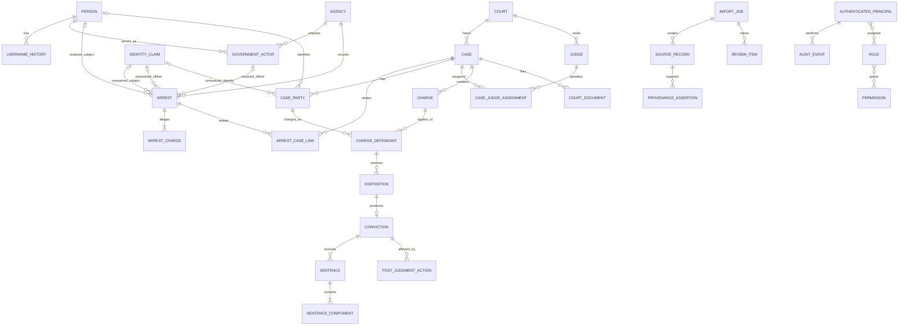

# Judicial Information System (JIS) Specification v1

**Status:** Approved architecture for foundational implementation
**Date:** 2026-08-13
**Scope:** Data architecture, security boundaries, ingestion contracts, and API design
**Related document:** [`ARCHITECTURE.md`](ARCHITECTURE.md)

This specification is the implementation blueprint for the Judicial Information System. It makes the foundational decisions needed for a later backend implementation. Approval of this document is an architecture gate; it does not authorize deployment, data migration, or publication of records.

## 1. Executive Summary

JIS will be the canonical normalized records system for the United States Courts. The current Trello court boards, the live Roblox arrest system, and historical Discord arrest logs are inputs to JIS, not databases of record.

JIS will maintain stable identities, court cases, count-level legal dispositions, sentences, arrests, documents, provenance, review decisions, authorization, and audit history. An arrest allegation is structurally separate from a filed court charge, and a filed charge is structurally separate from a verified conviction. A conviction can be created only from a verified, conviction-producing disposition on a court charge.

The recommended implementation is a small Node.js/TypeScript service using Fastify, PostgreSQL, a typed SQL layer, schema validation, and a PostgreSQL-backed worker/outbox. It should be deployed separately from this static Jekyll/GitHub Pages repository. GitHub Pages will remain the public Courts front end and will call only public JIS endpoints over HTTPS. Restricted background checks and administrative workflows will run in a backend-hosted authenticated application.

## 2. Goals

1. Preserve legal-status accuracy at the charge/count level.
2. Make every material imported or derived fact traceable to source evidence.
3. Use Roblox UserId as the stable identity for resolved people.
4. Support public court records and separately controlled justice/LEO workflows.
5. Ingest records safely from Trello, a Roblox game server, and historical Discord exports.
6. Preserve corrections, reversals, pardons, commutations, and vacatur without destructive history loss.
7. Provide stable, versioned API contracts for the Courts site, Court Bot, and restricted clients.
8. Remain simple enough to operate as one application, one worker process, and one relational database initially.

The priority order is: legal accuracy, provenance, stable identity, security, maintainability, API clarity, migration safety, user experience, and implementation simplicity.

## 3. Non-Goals

Version 1 architecture does not:

- replace Trello immediately;
- implement a production backend or database;
- implement Roblox OAuth or group authorization;
- parse Discord HTML, Trello cards, or court documents;
- use AI to determine legal dispositions;
- create a background-check interface;
- implement Court Bot commands;
- store real-world names, addresses, birthdates, or other unnecessary personal information;
- model an intermediate Court of Appeals;
- promise that every arrest, case, or document will be public;
- design for internet-scale traffic or a microservice fleet.

## 4. System Context



The existing site architecture reserves future `/cases/`, `/dockets/`, `/people/`, `/records/`, `/arrests/`, `/judges/`, and `/api/v1/` concepts. JIS provides the governed service behind those concepts. It does not turn the static repository into a backend.

Existing public routes—including `/case-search.html`, `/docs/`, `/frcp/`, `/frcmp/`, `/fre/`, `/supct/`, and the retained `/frap/` reference—remain stable. CourtListener can continue powering the present Supreme Court case-law search while JIS is built for USAR-native records. No route should point to placeholder JIS data.

### Recommended deployable architecture

| Component | Recommendation | Reason |
| --- | --- | --- |
| Runtime | Current supported Node.js LTS with TypeScript | Fits existing bot skills and provides one language across API, workers, and import tooling. |
| HTTP server | Fastify | Small, schema-oriented, and suitable for a dependency-light REST service. |
| Validation | TypeBox JSON schemas registered with Fastify | Reuse request/response schemas for runtime validation, TypeScript types, and OpenAPI generation. |
| Database | PostgreSQL | Strong foreign keys, transactions, JSONB for source snapshots, and relational queries across justice records. |
| Data access | Kysely with `pg` | Keeps the schema and SQL visible; avoids hiding legal invariants behind a large ORM. |
| Migrations | Ordered SQL migrations executed by the backend toolchain | Reviewable constraints are essential for a records system. |
| Jobs | Separate worker entry point using PostgreSQL job/outbox tables | Avoids Redis and a second operational datastore in v1. |
| API description | OpenAPI generated from validated route schemas | Gives the Courts site, Court Bot, and game integrations a shared contract. |
| Deployment | One API process, one worker process, PostgreSQL, and encrypted backups | Simple to run and expand without adopting microservices. |

The backend should live in a separate private repository, tentatively `jis-backend`. This public static repository should contain this specification and future public integration code only.

## 5. Source Systems

### 5.1 Court system Trello

The current site reads the configured Supreme Court and District Court boards directly in `assets/dockets.js`, with a generated last-known-good fallback. JIS should initially synchronize those same configured boards without changing the public docket workflow.

Trello list names, labels, card titles, and descriptions are routing hints, not sufficient proof of conviction. A court ingestion run should collect cards, list membership, attachments, linked documents, and source update timestamps. Criminal disposition facts must come from an authoritative judgment, accepted plea, verdict, dismissal/acquittal order, or other court order and must satisfy the verification rules in section 11.

### 5.2 Live Roblox arrest system

The live flow becomes:

```text
Roblox server Script -> authenticated JIS endpoint -> database transaction
                                                    -> outbox event -> Discord
```

The game server submits an arrest event with a stable source event ID. JIS generates the canonical UUID and human-readable arrest number. Discord is notified only after commit; a Discord failure never rolls back the arrest.

Only a Roblox server Script may submit. A LocalScript or browser client must never receive the service credential or call the ingestion route directly. Roblox documents that `HttpService` external requests are server-side and that credentials can be stored in the experience secrets store; see [HttpService](https://create.roblox.com/docs/reference/engine/classes/HttpService) and [Secrets stores](https://create.roblox.com/docs/cloud-services/secrets).

### 5.3 Historical Discord arrest logs

Historical HTML is processed through a reusable parser into versioned JSONL. Parsing never writes directly to canonical tables. It produces import records, validation findings, identity claims, and possible duplicate candidates. Accepted rows are committed through the same application services used by live ingestion.

The import preserves Discord guild/channel/message IDs, message timestamp, export checksum, embed index, embed field names, raw field values, parser version, and a restricted raw source snapshot. Discord message IDs are source identifiers, not arrest identifiers.

## 6. Trust Boundaries

| Boundary | Trust level | Permitted calls | Required controls |
| --- | --- | --- | --- |
| Public browser | Untrusted | Public `GET /api/v1/*` endpoints | HTTPS, strict CORS allowlist, validation, public rate limit; no secrets. |
| Authenticated Roblox user | Identified but not automatically authorized | OAuth login and endpoints allowed by internal JIS role | Server-side session, CSRF protection, refreshed authorization. |
| Roblox game client/LocalScript | Untrusted | None | It may ask the game server to act; the server independently validates game rules. |
| Roblox game server | Trusted service for arrest submission only | `POST /internal/v1/arrests` | Experience secret, HTTPS, timestamp, idempotency/replay checks, allowlisted service principal, rate limit. |
| Discord bot/Court Bot | Trusted scoped service | Explicit bot endpoints | Distinct revocable service token, least privilege, audit events. |
| JIS API | Policy enforcement boundary | Database and approved external integrations | Validation, transactions, authorization, audit, secret management. |
| JIS worker | Trusted background processor | Database, Trello, Discord, document sources | Separate service identity, bounded jobs, retries, provenance. |
| PostgreSQL | Most trusted data boundary | API/worker only | Private network, TLS where applicable, least-privilege roles, encrypted backups. |
| Trello/Discord/Roblox APIs | External sources | Worker/API outbound requests only | Timeouts, rate limits, source validation, no implicit legal truth. |
| Administrator/reviewer | Privileged human | Restricted portal/CLI | Strong session controls, role checks, audit, reason-required decisions. |

No request crosses a boundary merely because it contains a Roblox UserId or role name. The receiving service verifies identity and authorization.

## 7. Identity Model

### 7.1 Canonical identity

`Person.id` is an internal application-generated UUIDv7 stored as PostgreSQL `uuid`. `Person.roblox_user_id` is the unique external identity and is serialized as a decimal string in JSON. Usernames, display names, Discord names, and manual aliases are attributes, never join keys.

Application-generated UUIDv7 is recommended because it is immutable, difficult to enumerate, and index-friendly. UUIDv4 is an acceptable implementation fallback if the selected UUID library cannot produce v7 safely.

### 7.2 Unresolved legacy identities

JIS must not create a canonical Person based only on a username. A historical record without a Roblox UserId receives an `IdentityClaim`:

- `unresolved`: no credible candidate yet;
- `candidate_found`: exactly one candidate suggested but not approved;
- `ambiguous`: multiple plausible candidates;
- `manually_verified`: a reviewer approved the Roblox UserId;
- `rejected`: the claim is not a person or cannot be used;
- `superseded`: replaced by a corrected claim.

An Arrest points to either `subject_person_id` or `subject_identity_claim_id`, enforced by a database check constraint requiring exactly one. An arresting officer, when the source identifies one, points to either `arresting_actor_id` or `arresting_identity_claim_id`; both may be null only when the source contains no officer identity. Background checks by Roblox UserId exclude unresolved subject claims. Merging two different Roblox UserIds is prohibited. Correcting an incorrectly attributed subject or officer requires a review decision, a new provenance assertion, and an audit event.

Bulk external identity resolution is neither required nor appropriate for username-only history. Public lookup may surface an otherwise-public historical Arrest under the exact username recorded by its source while the subject or officer claim remains unresolved, provided the response and user interface explicitly identify it as historical username-only data. A current `Person.current_username` match is discovery information only: it does not resolve, merge, or attribute the historical Arrest to that Person. The canonical UserId arrest endpoint must continue to exclude unresolved claims even when names match.

### 7.3 Username handling

Current username and display name are cacheable mutable fields. Every verified username change adds or closes a `UsernameHistory` interval. Historical source spelling is retained in the source snapshot even when it differs from the verified account name.

## 8. Data Classification

Use four access levels:

| Level | Meaning | Examples |
| --- | --- | --- |
| `public` | Safe for unauthenticated publication | Public docket metadata, public case dispositions, designated public orders, courts, judges. |
| `restricted_leo` | Authorized law-enforcement and justice access | Complete arrest history and operational arrest details. |
| `restricted_justice` | Justice personnel and administrators | Non-public filings, disposition review, prosecution workflow, protected notes. |
| `admin_only` | JIS administrators/reviewers | Raw imports, identity candidates, credentials metadata, audit logs, source conflicts. |

Rules:

1. Default new imported data to the most restrictive applicable level, never `public` by inference.
2. A parent being public does not make every child document public.
3. Public API projections use an explicit allowlist of fields; they do not serialize database rows directly.
4. Consolidated background checks and complete arrest history are restricted even if some component court records are public.
5. Raw Discord exports, law-enforcement notes, evidence identifiers, game server/job identifiers, and audit events are never public.
6. Public conviction information is a projection of public case/count/disposition records, not a separate disclosure decision.

## 9. Core Entity Model

The canonical model contains:

- Identity: `Person`, `UsernameHistory`, `IdentityClaim`.
- Institutions: `Agency`, `GovernmentActor`, `Court`, `Judge`.
- Law enforcement: `Arrest`, `ArrestCharge`, `ArrestCaseLink`.
- Courts: `Case`, `CaseParty`, `Charge`, `ChargeDefendant`, `Disposition`, `Conviction`, `PostJudgmentAction`, `Sentence`, `SentenceComponent`, `CourtDocument`.
- Governance: `SourceRecord`, `ProvenanceAssertion`, `ImportJob`, `SourceSyncState`, `ReviewItem`, `AuthenticatedPrincipal`, `Role`, `Permission`, `AuditEvent`, `OutboxEvent`.

All mutable canonical tables include `created_at`, `updated_at`, `archived_at`, and an optimistic concurrency `version`. Justice records use soft archive/supersession; `updated_at` is not a substitute for an audit trail.

## 10. Detailed Entity Schemas

Database names below use `snake_case`; API examples use `camelCase`. All timestamps are PostgreSQL `timestamptz` and ISO 8601 UTC strings in JSON.

### 10.1 Person

**Purpose:** Canonical resolved Roblox identity.
**Primary identifier:** `id uuid`; unique `roblox_user_id numeric(20,0)`.
**Fields:** `roblox_user_id`, `current_username`, `display_name`, `account_status` (`active`, `inactive`, `banned`, `deleted`, `unknown`), `last_verified_at`, `access_level`, timestamps/archive fields.
**Relationships:** Has username history, arrests, case-party records, government-actor records, and authenticated principals.
**Provenance:** Roblox verification source plus provenance for manual corrections.
**Access:** Basic identity may be public only when exposed through a public record; full record is restricted.

```json
{"id":"0198a2f0-7f6d-7d0a-8e10-0b77d7b63c01","robloxUserId":"123456789","currentUsername":"ExampleUser","displayName":"Example","accountStatus":"active","lastVerifiedAt":"2026-08-13T19:00:00Z"}
```

### 10.2 UsernameHistory

**Purpose:** Time-bounded verified usernames and display names.
**Primary identifier:** `id uuid`.
**Fields:** `person_id`, `username`, `display_name`, `observed_from`, `observed_until`, `verification_status`.
**Relationships:** Belongs to Person and SourceRecord. Only one open verified username interval per person.
**Provenance:** Required `source_record_id`; manual observations identify the reviewer.
**Access:** Restricted by default; a current public username may be projected from Person.

```json
{"id":"0198a2f1-008a-71f2-91ab-31f76d0ff101","personId":"0198a2f0-7f6d-7d0a-8e10-0b77d7b63c01","username":"ExampleUser","observedFrom":"2026-06-01T12:00:00Z","observedUntil":null,"verificationStatus":"verified"}
```

### 10.3 IdentityClaim

**Purpose:** Holds a source identity that cannot yet be joined to a Person.
**Primary identifier:** `id uuid`.
**Fields:** `raw_username`, `raw_user_id`, `claim_context` (`arrest_subject`, `arresting_officer`, `case_party`, `other`), `status`, `candidate_person_ids`, `resolved_person_id`, `resolution_method`, `resolved_by`, `resolved_at`.
**Relationships:** Belongs to SourceRecord; may temporarily identify an arrest subject, arresting officer, or CaseParty.
**Provenance:** The exact source field and raw value are required.
**Access:** `admin_only`.

```json
{"id":"0198a2f1-32ec-77a0-8091-37a92dd50101","rawUsername":"JohnDoe123","rawUserId":null,"claimContext":"arrest_subject","status":"ambiguous","candidatePersonIds":["0198a2f0-7f6d-7d0a-8e10-0b77d7b63c01"]}
```

### 10.4 Agency

**Purpose:** Government or law-enforcement organization.
**Primary identifier:** `id uuid`; unique stable `slug`.
**Fields:** `slug`, `name`, `abbreviation`, `agency_type`, `active`, `access_level`.
**Relationships:** Has GovernmentActors and Arrests.
**Provenance:** Creation/update source or administrative authority.
**Access:** Public directory fields; internal configuration restricted.

```json
{"id":"0198a2f2-1000-75c4-8ce3-8572fe10aa01","slug":"fbi","name":"Federal Bureau of Investigation","abbreviation":"FBI","agencyType":"law_enforcement","active":true}
```

### 10.5 GovernmentActor

**Purpose:** A resolved Person acting for an Agency, including an arresting officer.
**Primary identifier:** `id uuid`.
**Fields:** `person_id`, `agency_id`, `title`, `badge_or_roster_id`, `status` (`active`, `inactive`, `suspended`, `unknown`), `effective_from`, `effective_until`.
**Relationships:** Belongs to Person and Agency; may be arresting actor or reviewer attribution. A source-only officer name remains an IdentityClaim until both the Person and agency relationship are verified.
**Provenance:** Roster/group verification or administrator assertion required.
**Access:** Public only when separately designated; operational details restricted.

```json
{"id":"0198a2f2-2000-7d40-83e9-34a2e426aa02","personId":"0198a2f0-7f6d-7d0a-8e10-0b77d7b63c02","agencyId":"0198a2f2-1000-75c4-8ce3-8572fe10aa01","title":"Special Agent","status":"active"}
```

### 10.6 Arrest

**Purpose:** Records a law-enforcement action; never proves guilt or conviction.
**Primary identifier:** `id uuid`; unique human `arrest_number`.
**Fields:** `arrest_number`, exactly one of `subject_person_id`/`subject_identity_claim_id`, `subject_username_at_arrest`, nullable `arresting_actor_id`, nullable `arresting_identity_claim_id`, `officer_username_at_arrest`, `agency_id`, `occurred_at`, `location_text`, `source_server_job_id`, `source_place_id`, `notes`, `system_version`, `status` (`recorded`, `corrected`, `voided`, `archived`), `verification_status`, `access_level`.
**Relationships:** Has ArrestCharges, ArrestCaseLinks, SourceRecords, and audit events; belongs to either a resolved GovernmentActor or unresolved officer IdentityClaim when the source names an officer.
**Provenance:** A primary SourceRecord is mandatory. Corrections are additional assertions, not source replacement.
**Access:** `restricted_leo` by default; no complete public arrest endpoint.

`id` is an application UUIDv7. `arrest_number` is allocated transactionally as `AR-{UTC year}-{six-digit yearly sequence}`. The UUID is the API identity; the human number is searchable and immutable. Sequence gaps are allowed after rolled-back or voided operations.

```json
{"id":"0198a2f3-0000-7b8d-8c8d-15b78ac1a001","arrestNumber":"AR-2026-000184","subjectPersonId":"0198a2f0-7f6d-7d0a-8e10-0b77d7b63c01","subjectUsernameAtArrest":"ExampleUser","arrestingActorId":"0198a2f2-2000-7d40-83e9-34a2e426aa02","officerUsernameAtArrest":"AgentExample","agencyId":"0198a2f2-1000-75c4-8ce3-8572fe10aa01","occurredAt":"2026-08-13T18:42:00Z","status":"recorded","verificationStatus":"source_authenticated","accessLevel":"restricted_leo"}
```

### 10.7 ArrestCharge / AllegedOffense

**Purpose:** An offense alleged at arrest; cannot carry a conviction status.
**Primary identifier:** `id uuid`.
**Fields:** `arrest_id`, `sequence`, structured statute fields (`code`, `title`, `section`, `subsection`, `display_citation`), `offense_name`, `raw_citation`, `allegation_text`, `status` (`alleged`, `corrected`, `withdrawn`), `verification_status`.
**Relationships:** Belongs to Arrest; may be mapped to zero or more ChargeDefendants through a link table.
**Provenance:** Source field/position required.
**Access:** Inherits Arrest unless independently approved for publication.

```json
{"id":"0198a2f3-0100-70f1-8cda-80dad16a1001","arrestId":"0198a2f3-0000-7b8d-8c8d-15b78ac1a001","sequence":1,"statute":{"code":"usc","title":"18","section":"111","subsection":"a","displayCitation":"18 U.S.C. § 111(a)"},"offenseName":"Assaulting a federal officer","status":"alleged"}
```

### 10.8 Court

**Purpose:** Court identity and routing.
**Primary identifier:** `id uuid`; unique `slug`.
**Fields:** `slug`, `name`, `short_name`, `court_level` (`supreme`, `trial`), `active`, `public_url`.
**Relationships:** Has Cases and Judges.
**Provenance:** Administrative configuration.
**Access:** Public.

Required seed rows are only `scotus` (Supreme Court of the United States) and `usdc` (United States District Court). District Court appeals link directly to a Supreme Court case where permitted. Existing Appellate Procedure materials remain reference content and do not create a Court of Appeals entity.

```json
{"id":"0198a2f4-0000-7ad1-885d-75cbe01a0002","slug":"usdc","name":"United States District Court","shortName":"District Court","courtLevel":"trial","active":true}
```

### 10.9 Judge

**Purpose:** Public judicial officeholder identity.
**Primary identifier:** `id uuid`.
**Fields:** optional restricted `person_id`, `court_id`, `display_name`, `title`, `status` (`active`, `inactive`, `retired`), `term_started_at`, `term_ended_at`, `sort_order`, `access_level`.
**Relationships:** Belongs to Court; assigned to Cases through `case_judge_assignment`.
**Provenance:** Court roster or administrator assertion.
**Access:** Public fields are public; Roblox identity linkage may remain restricted.

```json
{"id":"0198a2f4-1000-77bf-9c6e-30313aa11001","courtId":"0198a2f4-0000-7ad1-885d-75cbe01a0002","displayName":"The Honorable Example Judge","title":"District Judge","status":"active"}
```

### 10.10 Case

**Purpose:** Canonical civil or criminal court matter.
**Primary identifier:** `id uuid`; public `docket_number`.
**Fields:** `court_id`, `docket_number`, `case_type` (`criminal`, `civil`, `other`), `caption`, `filed_at`, `closed_at`, `status` (`draft`, `filed`, `pending`, `stayed`, `closed`, `archived`), `access_level`, `primary_source_record_id`.
**Relationships:** Has parties, judge assignments, Charges, Documents, related Cases, and ArrestCaseLinks.
**Provenance:** Source card plus court documents; source metadata is not itself a disposition.
**Access:** Public when designated public; sealed/restricted cases are omitted from public APIs.

The docket number is not the primary key because formatting or scope rules may change and corrections must not break foreign keys. Enforce unique `(court_id, normalized_docket_number)`. Resolve API resources by UUID; support exact docket filtering separately.

```json
{"id":"0198a2f5-0000-7b43-9f88-c1d1c4a5c012","courtId":"0198a2f4-0000-7ad1-885d-75cbe01a0002","docketNumber":"CR-081326-0012","caseType":"criminal","caption":"United States v. ExampleUser","filedAt":"2026-08-13T20:15:00Z","status":"pending","accessLevel":"public"}
```

### 10.11 CaseParty

**Purpose:** A party or participant in a Case without assuming every name resolves to a Person.
**Primary identifier:** `id uuid`.
**Fields:** `case_id`, nullable `person_id`, nullable `identity_claim_id`, `display_name`, `party_role` (`plaintiff`, `defendant`, `petitioner`, `respondent`, `appellant`, `appellee`, `other`), `is_government`, `status` (`active`, `removed`, `superseded`).
**Relationships:** Belongs to Case and optionally Person/IdentityClaim.
**Provenance:** Filing or verified court metadata.
**Access:** Inherits Case, with field redaction available.

```json
{"id":"0198a2f5-1000-75e7-8ac2-6352bb131001","caseId":"0198a2f5-0000-7b43-9f88-c1d1c4a5c012","personId":"0198a2f0-7f6d-7d0a-8e10-0b77d7b63c01","displayName":"ExampleUser","partyRole":"defendant","status":"active"}
```

### 10.12 Charge / Count

**Purpose:** A numbered court charge distinct from an arrest allegation.
**Primary identifier:** `id uuid`; unique `(case_id, count_number, revision)`.
**Fields:** `case_id`, `count_number`, `revision`, optional `supersedes_charge_id`, structured statute fields, `offense_name`, `raw_charge_text`, `filing_status` (`proposed`, `filed`, `amended`, `superseded`, `withdrawn`), `filed_at`, `verification_status`, `access_level`.
**Relationships:** Belongs to criminal Case; has ChargeDefendants and may map those defendants to ArrestCharges.
**Provenance:** Charging document required for `filed`; amendment document required for revisions.
**Access:** Usually inherits public criminal Case.

```json
{"id":"0198a2f5-2000-7a66-918e-1dcc2a121001","caseId":"0198a2f5-0000-7b43-9f88-c1d1c4a5c012","countNumber":1,"revision":1,"statute":{"code":"usc","title":"18","section":"111","subsection":"a","displayCitation":"18 U.S.C. § 111(a)"},"offenseName":"Assaulting a federal officer","filingStatus":"filed","verificationStatus":"verified"}
```

#### ChargeDefendant

**Purpose:** Identifies which defendant CaseParty is subject to a Charge so multi-defendant cases can have different outcomes on the same count.
**Primary identifier:** `id uuid`; unique `(charge_id, case_party_id)`.
**Fields:** `charge_id`, `case_party_id`, `status` (`charged`, `withdrawn`, `superseded`), `verification_status`.
**Relationships:** Belongs to Charge and a defendant CaseParty; receives Dispositions.
**Provenance:** Charging document span identifying both count and defendant.
**Access:** Inherits Charge/Case.

```json
{"id":"0198a2f5-2500-72d1-90b5-2ef835211001","chargeId":"0198a2f5-2000-7a66-918e-1dcc2a121001","casePartyId":"0198a2f5-1000-75e7-8ac2-6352bb131001","status":"charged","verificationStatus":"verified"}
```

### 10.13 Disposition

**Purpose:** A dated legal result for one Charge as applied to one defendant.
**Primary identifier:** `id uuid`.
**Fields:** `charge_defendant_id`, `result` (`pending`, `convicted`, `dismissed`, `acquitted`, `nolle_prosequi`, `deferred`, `transferred`, `other`), `basis` (`accepted_plea`, `verdict`, `court_order`, `prosecution_notice`, `unknown`), `effective_at`, `entered_at`, `is_current`, `supersedes_disposition_id`, `verification_status`, `verified_by`, `verified_at`, `source_document_id`.
**Relationships:** Belongs to ChargeDefendant; a verified `convicted` result may have exactly one Conviction.
**Provenance:** Authoritative CourtDocument plus field-level assertion required.
**Access:** Inherits ChargeDefendant/Case.

Only one current disposition is allowed per ChargeDefendant. `is_current` is maintained transactionally; historical rows remain. `basis=accepted_plea` means the court accepted the plea, not merely that a plea document exists.

```json
{"id":"0198a2f5-3000-7fd0-8471-0934d8911001","chargeDefendantId":"0198a2f5-2500-72d1-90b5-2ef835211001","result":"convicted","basis":"accepted_plea","effectiveAt":"2026-09-02T21:00:00Z","isCurrent":true,"verificationStatus":"verified","sourceDocumentId":"0198a2f6-0000-72c9-8a71-092ca6701001"}
```

### 10.14 Conviction

**Purpose:** A derived, durable record that a verified defendant-specific disposition produced a conviction.
**Primary identifier:** `id uuid`; unique `originating_disposition_id`.
**Fields:** `charge_defendant_id`, `originating_disposition_id`, `convicted_at`, `current_status` (`active`, `vacated`, `reversed`, `pardoned`, `superseded`), `status_effective_at`, `verification_status`.
**Relationships:** Belongs to ChargeDefendant/Disposition; has Sentences and PostJudgmentActions.
**Provenance:** Inherits the verified disposition evidence; current status cites the latest controlling action.
**Access:** Public only when the underlying case and disposition are public.

Conviction rows are created by the disposition application service, never by arrest ingestion or a free-standing administrator form. `pardoned` preserves the historical conviction while recording relief; `vacated` and `reversed` mean it is not a current conviction.

```json
{"id":"0198a2f5-4000-7565-9786-0b35a6721001","chargeDefendantId":"0198a2f5-2500-72d1-90b5-2ef835211001","originatingDispositionId":"0198a2f5-3000-7fd0-8471-0934d8911001","convictedAt":"2026-09-02T21:00:00Z","currentStatus":"active","verificationStatus":"verified"}
```

### 10.15 PostJudgmentAction

**Purpose:** Preserves later legal effects without deleting the original conviction or sentence.
**Primary identifier:** `id uuid`.
**Fields:** `conviction_id`, optional `sentence_id`, `action_type` (`vacatur`, `reversal`, `pardon`, `commutation`, `amended_judgment`, `resentencing`, `reinstatement`), `effective_at`, `summary`, `source_document_id`, `verification_status`, optional `supersedes_action_id`.
**Relationships:** Belongs to Conviction and optionally Sentence.
**Provenance:** Controlling order/pardon document required.
**Access:** Inherits the associated case.

```json
{"id":"0198a2f5-5000-7d2a-8c01-151611221001","convictionId":"0198a2f5-4000-7565-9786-0b35a6721001","actionType":"vacatur","effectiveAt":"2027-01-10T18:00:00Z","summary":"Conviction vacated by order of the Supreme Court.","verificationStatus":"verified"}
```

### 10.16 Sentence and SentenceComponent

**Purpose:** Represents an imposed sentence in both structured and source-faithful form.
**Primary identifiers:** `sentence.id uuid`, `sentence_component.id uuid`.
**Sentence fields:** `conviction_id`, `source_document_id`, `imposed_at`, `raw_text`, `status` (`imposed`, `amended`, `vacated`, `completed`, `superseded`), optional `supersedes_sentence_id`, `verification_status`.
**Component fields:** `sentence_id`, `component_type` (`imprisonment`, `fine`, `probation`, `suspension`, `disqualification`, `community_service`, `other`), numeric `amount`, `unit`, `currency`, `effective_from`, `effective_until`, `details`.
**Relationships:** Sentence belongs to Conviction; components belong to Sentence.
**Provenance:** Sentencing judgment/order required; raw text retained.
**Access:** Inherits Case/Document.

```json
{"id":"0198a2f5-6000-7124-91d1-caa48f211001","convictionId":"0198a2f5-4000-7565-9786-0b35a6721001","imposedAt":"2026-09-10T20:00:00Z","status":"imposed","rawText":"Thirty days' imprisonment and a $5,000 fine.","components":[{"type":"imprisonment","amount":"30","unit":"day"},{"type":"fine","amount":"5000.00","currency":"USD"}]}
```

### 10.17 CourtDocument

**Purpose:** Durable metadata for a filing, order, opinion, judgment, or evidentiary source.
**Primary identifier:** `id uuid`.
**Fields:** `case_id`, `title`, `document_type` (`charging_document`, `plea`, `verdict`, `order`, `judgment`, `sentence`, `opinion`, `pardon`, `commutation`, `other`), `filed_at`, `source_url`, `storage_key`, `source_attachment_id`, `sha256`, `mime_type`, `byte_size`, `access_level`, `publication_status` (`pending_review`, `public`, `restricted`, `sealed`), `text_extraction_status` (`not_requested`, `queued`, `extracted`, `failed`, `unsupported`), `parser_version`.
**Relationships:** Belongs to Case and SourceRecord; supports Dispositions, Sentences, and PostJudgmentActions.
**Provenance:** Source URL/attachment ID and checksum required when content is retrievable.
**Access:** Explicit per document; a public case does not override a restricted document. `access_level` controls who may read the record, while `publication_status` records the publication/sealing decision. `publication_status=public` requires `access_level=public`; `sealed` requires `restricted_justice` or `admin_only`.

```json
{"id":"0198a2f6-0000-72c9-8a71-092ca6701001","caseId":"0198a2f5-0000-7b43-9f88-c1d1c4a5c012","title":"Judgment","documentType":"judgment","filedAt":"2026-09-02T21:00:00Z","sourceUrl":"https://trello.com/example-attachment","sha256":"7f83b1657ff1fc53b92dc18148a1d65dfa13514d6f319dd472e29bb6d8a8e5a6","mimeType":"application/pdf","accessLevel":"public","publicationStatus":"public","textExtractionStatus":"extracted"}
```

### 10.18 SourceRecord / Provenance

**Purpose:** Immutable snapshot metadata for an external source object or manual authority.
**Primary identifier:** `id uuid`; unique `(source_system, source_namespace, source_key, source_version)`.
**Fields:** `source_system` (`trello`, `roblox_game`, `discord`, `roblox_api`, `manual`), `source_namespace`, `source_key`, `source_version`, `source_url`, `parent_source_record_id`, `observed_at`, `source_updated_at`, `ingested_at`, `content_sha256`, `raw_payload jsonb`, `parser_name`, `parser_version`, `verification_status` (`unverified`, `source_authenticated`, `automatically_extracted`, `needs_review`, `verified`, `rejected`, `superseded`), `access_level`.
**Relationships:** May be the origin/evidence for any canonical record through ProvenanceAssertions.
**Provenance:** It is the provenance anchor; source changes create a new version rather than overwrite the prior snapshot.
**Access:** Usually `admin_only`; safe source URLs may be projected publicly.

```json
{"id":"0198a2f7-0000-77ad-91a8-2eabf6701001","sourceSystem":"trello","sourceNamespace":"board:district:card","sourceKey":"trello-card-abc123","sourceVersion":"2026-09-02T21:05:00Z","sourceUrl":"https://trello.com/c/example","ingestedAt":"2026-09-02T21:06:10Z","parserName":"trello-sync","parserVersion":"1.0.0","verificationStatus":"source_authenticated"}
```

`ProvenanceAssertion` links a SourceRecord to a specific entity and optional field path.

```json
{"id":"0198a2f7-1000-79f2-8821-fad7dd701001","sourceRecordId":"0198a2f7-0000-77ad-91a8-2eabf6701001","targetType":"disposition","targetId":"0198a2f5-3000-7fd0-8471-0934d8911001","fieldPath":"result","extractionMethod":"human_verified","rawLocator":{"attachmentId":"att-123","page":1,"textSpan":"Count 1"},"verificationStatus":"verified"}
```

The generic target is restricted to an allowlist. The first implementation must run orphan-integrity tests because PostgreSQL cannot apply one foreign key across polymorphic target tables. Every legal fact also carries a direct primary evidence foreign key where defined.

### 10.19 ImportJob

**Purpose:** Tracks a bounded import or synchronization attempt.
**Primary identifier:** `id uuid`.
**Fields:** `job_type` (`discord_history`, `trello_sync`, `document_reprocess`, `identity_refresh`), `status` (`queued`, `running`, `awaiting_review`, `completed`, `completed_with_errors`, `failed`, `cancelled`), input checksum/location, parser version, counters, timestamps, error summary, `started_by_principal_id`.
**Relationships:** Has SourceRecords and ReviewItems.
**Provenance:** Records the parser/configuration version and immutable input checksum.
**Access:** `admin_only`.

```json
{"id":"0198a2f8-0000-7893-9cb1-70b64e001001","jobType":"discord_history","status":"awaiting_review","inputSha256":"28d2f5a1e11f...","parserVersion":"1.0.0","recordsSeen":320,"recordsAccepted":289,"recordsNeedingReview":31}
```

### 10.20 ReviewItem

**Purpose:** Human decision queue for ambiguity, conflicts, and possible duplicates.
**Primary identifier:** `id uuid`.
**Fields:** `reason` (`identity_ambiguity`, `disposition_ambiguity`, `possible_duplicate`, `source_conflict`, `invalid_record`, `publication_access`, `other`), `status` (`open`, `assigned`, `resolved`, `rejected`, `superseded`), `priority`, `target_type`, `target_id`, `candidate_values jsonb`, `evidence_source_ids`, `assigned_to`, `decision`, `decision_reason`, `resolved_by`, `resolved_at`.
**Relationships:** Belongs to ImportJob optionally; references evidence and audited reviewer.
**Provenance:** Candidate values retain their source IDs.
**Access:** `admin_only` or designated justice reviewers.

```json
{"id":"0198a2f8-1000-7634-9e2a-904b1f101001","reason":"source_conflict","status":"open","targetType":"charge","targetId":"0198a2f5-2000-7a66-918e-1dcc2a121001","candidateValues":[{"value":"convicted","sourceRecordId":"src-card"},{"value":"dismissed","sourceRecordId":"src-order"}],"decision":null}
```

### 10.21 AuthenticatedPrincipal, Role, and Permission

**Purpose:** Represents human and service identities separately from justice-subject Person records.
**Primary identifiers:** UUIDs.
**Principal fields:** `principal_type` (`roblox_user`, `service`, `administrator`), optional `person_id`, `service_name`, `status` (`active`, `suspended`, `revoked`), `last_authenticated_at`.
**Role fields:** `key` (`law_enforcement`, `justice`, `jis_administrator`), name, active.
**Permission fields:** stable key such as `background_checks.read`, `arrests.ingest`, `cases.write`, `records.review`, `audit.read`.
**Relationships:** Principals receive roles through time-bounded assignments; roles receive permissions.
**Provenance:** Role assignments record policy rule, group/rank evidence, issuer, and refresh time.
**Access:** `admin_only` except a principal may inspect its own session/roles.

```json
{"id":"0198a2f9-0000-7c19-9375-d088e3301001","principalType":"roblox_user","personId":"0198a2f0-7f6d-7d0a-8e10-0b77d7b63c02","status":"active","roles":["justice"],"permissions":["background_checks.read","cases.write"]}
```

```json
{"role":{"id":"0198a2f9-1000-7591-8e21-8032fc011001","key":"justice","name":"Justice","active":true},"permission":{"id":"0198a2f9-2000-7e61-9bc0-944e29011001","key":"background_checks.read","description":"Read consolidated restricted background checks"}}
```

`public` is an access level, not an assigned role. Keep the initial permission catalog small; endpoints check permissions, while configurable role mappings decide who receives them.

### 10.22 AuditEvent

**Purpose:** Append-only security and administrative activity record.
**Primary identifier:** `id uuid`.
**Fields:** `occurred_at`, `request_id`, `principal_id`, `effective_role_keys`, `action`, `target_type`, `target_id`, `subject_person_id`, `result` (`success`, `denied`, `failed`), `reason_code`, `ip_hash_or_prefix`, `user_agent_summary`, `metadata jsonb`, `previous_event_hash`, `event_hash`.
**Relationships:** References Principal and optionally target/subject.
**Provenance:** Created by JIS itself; hash chaining is optional defense-in-depth, not a substitute for database controls.
**Access:** `admin_only`.

```json
{"id":"0198a2fa-0000-7bc0-9840-94b230101001","occurredAt":"2026-08-13T21:37:00Z","principalId":"0198a2f9-0000-7c19-9375-d088e3301001","effectiveRoleKeys":["justice"],"action":"background_check.read","targetType":"person","targetId":"0198a2f0-7f6d-7d0a-8e10-0b77d7b63c01","result":"success","requestId":"req_01J5..."}
```

### 10.23 Supporting entities

- `ArrestCaseLink`: many-to-many link with `relationship_type` (`resulted_in`, `related`, `possible_match`, `ruled_unrelated`), verification status, and provenance. It permits no prosecution, one case, or multiple cases.
- `ArrestEvidenceReference`: restricted external evidence identifier and optional validated URL; it records linkage only and does not make evidence content public.
- `CaseRelation`: connects cases using `appeal_of`, `consolidated_with`, `related_to`, or `supersedes`. A District Court appeal may point directly to a Supreme Court case.
- `CaseDocketIdentifier`: preserves the current and prior normalized docket numbers with effective intervals and correction provenance; exactly one identifier is current per Case.
- `CaseJudgeAssignment`: judge, case, assignment role, effective interval, and source.
- `ChargeArrestAllegationLink`: optional evidence-backed mapping between a ChargeDefendant and an ArrestCharge; it never copies disposition state backward into the arrest.
- `SourceSyncState`: per source namespace `last_attempt_at`, `last_successful_sync_at`, cursor, last error, counters, parser version, and health status.
- `OutboxEvent`: event type, aggregate ID, payload, created time, attempts, next attempt, delivered time, and terminal failure. It drives Discord delivery and later integrations.

## 11. Legal Status / Disposition Model

### 11.1 Separate legal layers

```text
ArrestCharge (allegation)
    optional evidence-backed mapping
Charge (filed count in a criminal case)
    ChargeDefendant (defendant-specific application of count)
    one or more time-ordered Dispositions
verified current Disposition(result=convicted)
    creates Conviction
Conviction
    zero or more Sentences and PostJudgmentActions
```

Prohibited shortcuts:

- ArrestCharge -> Conviction
- Trello label `Convicted` -> Conviction
- charging document -> Conviction
- plea document not shown accepted by the court -> Conviction
- sentencing-looking attachment with unclear counts -> Conviction
- case status `closed` -> Conviction

### 11.2 Verification dimensions

These are independent fields and must never be collapsed into one “confidence” number:

1. **Identity resolution:** unresolved, candidate, ambiguous, manually verified.
2. **Extraction state:** not attempted, automatically extracted, failed, needs review.
3. **Administrator verification:** unverified, verified, rejected, superseded.
4. **Legal status:** arrest status, charge filing status, disposition result, conviction current status, or sentence status.

### 11.3 Conviction creation rule

The service may create a Conviction only in the same transaction that sets a Disposition to:

- `result = convicted`;
- `verification_status = verified`;
- a supported `basis` of `accepted_plea`, `verdict`, or `court_order`;
- a non-null authoritative `source_document_id`;
- a verified ChargeDefendant linked to a defendant CaseParty with a resolved Person.

If any condition is absent, the extraction remains staged and a ReviewItem is opened. A PostgreSQL deferrable constraint trigger should reject a Conviction whose originating disposition does not satisfy the first four conditions; the application enforces the resolved-person rule.

Required database invariants include:

- partial unique index on `disposition(charge_defendant_id) WHERE is_current`;
- unique `conviction.originating_disposition_id`;
- exactly one Arrest subject reference (`subject_person_id` XOR `subject_identity_claim_id`);
- at most one Arrest officer reference (`arresting_actor_id` XOR `arresting_identity_claim_id`), and exactly one when `officer_username_at_arrest` is present; a resolved actor's Agency must match the Arrest Agency;
- a CourtDocument with `publication_status=public` must have `access_level=public`, while `sealed` must use `restricted_justice` or `admin_only`;
- exactly one unresolved/resolved CaseParty identity reference where a person identity is claimed;
- immutable arrest number and accepted external source keys; Roblox UserId reattribution and docket-number correction require governed commands that preserve the prior value and audit the change;
- no hard delete of accepted justice records through the runtime database role.

### 11.4 Later actions

- **Vacatur/reversal:** append PostJudgmentAction; set current conviction status to `vacated` or `reversed`; retain origin and sentence history.
- **Pardon:** append action; current status becomes `pardoned`; background output labels it as a historical pardoned conviction, not active.
- **Commutation:** append action tied to the Sentence; conviction remains active unless another order changes it; create a superseding Sentence reflecting the reduced sanction.
- **Amended judgment/resentencing:** create a new Sentence with `supersedes_sentence_id`; old sentence becomes `superseded`.
- **Reinstatement:** append action and restore active status only with verified controlling evidence.

Current status is updated transactionally as a query optimization. The event chain remains authoritative and is recomputable.

## 12. Provenance Model

Every material fact must answer: source system, native identifier, source URL/location, observation time, parser version, extraction method, verification state, verifier, and whether a newer source supersedes it.

### 12.1 Provenance layers

1. `SourceRecord` stores immutable external snapshots and hashes.
2. `ProvenanceAssertion` says which source supports which entity/field and where the value appeared.
3. Direct evidence foreign keys on Disposition, Sentence, and PostJudgmentAction guarantee controlling-document integrity.
4. `AuditEvent` records who accepted, rejected, corrected, or published the fact.

### 12.2 Source precedence

Source precedence is legal-context-specific, not “last write wins.” A verified judgment/order controls over a Trello label for disposition. A later verified order controls current effect over an earlier judgment but does not erase it. Roblox API verification controls current Roblox username over a Discord embed spelling. Conflicts create ReviewItems unless a deterministic rule approved in this specification applies.

### 12.3 Source change detection

Workers compare native update tokens and content SHA-256. Changed source content creates a new SourceRecord version and a diff/review event. It never mutates a human-verified legal fact automatically. Unverified extracted facts may be superseded and re-extracted.

## 13. Deduplication Strategy

Deduplication is staged: exact idempotency checks first, deterministic unique keys second, similarity candidates third, and human review last.

### 13.1 Arrests

- Exact live duplicate: unique `(source_service_principal_id, source_event_id)` or Idempotency-Key returns the original response.
- Exact Discord duplicate: unique `(guild_id, channel_id, message_id, embed_index)`.
- Possible cross-source duplicate: subject Roblox UserId, agency, officer, close timestamp window, location, and normalized alleged offenses generate a candidate score and ReviewItem.
- Never merge solely on subject plus charge, username, or timestamp.
- Accepted duplicates are linked and one record is marked `superseded`/`voided`; both source histories remain.

### 13.2 Cases

- Unique normalized docket number within Court is the primary deterministic key.
- Trello card ID is a unique source key, not a replacement case key.
- A different card with the same court+docket attaches as another source or enters conflict review; it does not create another Case silently.

### 13.3 Documents

- Same source attachment ID under the same source system is identical unless source version changed.
- Same SHA-256 is content-identical and may reuse an archived blob while retaining separate filing/source relationships.
- URL and filename are weak hints only.
- A document with the same hash in two cases remains related to both cases.

### 13.4 People

- Same verified Roblox UserId resolves to the same Person.
- Different Roblox UserIds never auto-merge.
- Subject- or officer-username-only matches produce context-specific IdentityClaims, not Person or GovernmentActor records.

## 14. Historical Import Strategy

### 14.1 Pipeline

```text
read-only Discord HTML export
  -> identify exporter/schema version
  -> parse messages and embeds
  -> normalized versioned JSONL
  -> schema validation and report
  -> exact deduplication
  -> identity resolution
  -> manual review
  -> transactional canonical import
  -> reconciliation report
```

### 14.2 JSONL interchange contract

Each line is independent and carries parsed data plus source locators:

```json
{"schemaVersion":"jis.discord-arrest-import.v1","source":{"exportSha256":"28d2f5a1e11f...","guildId":"111111111111111111","channelId":"222222222222222222","messageId":"333333333333333333","messageTimestamp":"2026-06-15T02:31:00Z","embedIndex":0},"subject":{"robloxUserId":null,"usernameRaw":"JohnDoe123","fieldLocator":{"fieldName":"Suspect","fieldIndex":0}},"officer":{"robloxUserId":null,"usernameRaw":"CoolFBIMan123","fieldLocator":{"fieldName":"Officer","fieldIndex":1}},"agency":{"raw":"FBI","normalizedSlug":"fbi"},"occurredAt":"2026-06-15T02:29:00Z","allegedOffenses":[{"rawCitation":"18 USC 111(a)","offenseNameRaw":"Assaulting a federal officer","fieldLocator":{"fieldName":"Charges","line":1}}],"raw":{"authorId":"444444444444444444","embed":{"title":"Arrest Report","fields":[{"name":"Suspect","value":"JohnDoe123"},{"name":"Officer","value":"CoolFBIMan123"}]}},"parser":{"name":"discord-html-arrests","version":"1.0.0"}}
```

`raw` is restricted and may be stored compressed outside the primary database with a checksum and storage key. Normalized values never replace raw locators. The import tool supports `parse`, `validate`, `plan`, and `apply` modes. `apply` requires an approved plan checksum and is idempotent.

### 14.3 Acceptance rules

- Missing required event time, agency, or subject identity data produces review rather than a fabricated default.
- A subject or officer username without a Roblox UserId creates a context-specific IdentityClaim. The Arrest may be imported with either or both identities unresolved; unresolved subjects are excluded from UserId background checks, and unresolved officers are not represented as GovernmentActors or used as verified officer/agency evidence.
- Parser warnings and rejected lines appear in a machine-readable and human-readable reconciliation report.
- Re-running the same export/parser version must not duplicate records.

## 15. Live Arrest Ingestion Design

### 15.1 Endpoint

`POST /internal/v1/arrests`

Required headers:

```http
Authorization: Bearer <experience-service-secret>
Content-Type: application/json
Idempotency-Key: 7f1f8555-73ea-41ea-8a81-e20d7b8f6f31
X-JIS-Sent-At: 2026-08-13T18:42:05Z
```

The experience secret is stored through Roblox's secret store and sent only by a server Script over HTTPS. Because the Roblox secret abstraction is designed for placing secrets into request URLs/headers rather than exposing raw key material, v1 recommends a rotatable bearer service credential plus timestamp and idempotency replay protection instead of custom Lua HMAC. If Roblox later supports an appropriate signing primitive, HMAC can be added as defense-in-depth without changing the body contract.

`X-JIS-Sent-At` is the transport-attempt timestamp used for replay protection; the game server refreshes it on every retry. The Idempotency-Key and body `sourceEventId` remain stable across those retries. Body field `occurredAt` is the immutable time the arrest occurred. A delayed or queued arrest may therefore have an old `occurredAt` while presenting a current `X-JIS-Sent-At`.

### 15.2 Validation and transaction

1. Authenticate an active service principal scoped to the expected Roblox universe.
2. Apply a service-specific rate limit.
3. Validate `X-JIS-Sent-At` within ±5 minutes of JIS server time. Reject a stale/future transport attempt even if its body contains a plausible arrest time.
4. Claim unique `(principal, idempotency_key)` before processing.
5. Validate all strings, IDs, charge count, place/universe, and payload size. Validate `occurredAt` independently: reject a value more than five minutes in the future, but do not reject a record merely because the arrest is more than five minutes old. An unusually delayed event may be accepted with a review/audit flag.
6. Require and verify subject/officer Roblox UserIds for live ingestion. Verify the officer/agency authorization from cached, recently refreshed policy evidence; if the authorization provider is unavailable and the cache is stale, fail closed with a retryable error. Unresolved officer identities are supported by the historical import path, not accepted from the authenticated live game service.
7. Insert SourceRecord, Arrest, ArrestCharges, provenance, audit event, and Discord outbox event in one transaction.
8. Return `201`; an exact replay returns `200` and the original identifiers.

Discord delivery occurs after commit. Exponential retries with jitter stop at a configured terminal threshold and produce an administrator ReviewItem/alert; the Arrest remains valid.

## 16. Court/Trello Ingestion Design

### 16.1 Synchronization stages

1. Fetch board/list/card metadata using a server-side Trello credential or approved public endpoint.
2. Upsert immutable SourceRecord versions by native IDs and update tokens.
3. Parse docket number, case caption, court/list routing, and candidate case status.
4. Match or create a Case by `(court, normalized docket)`.
5. Discover attachments and linked documents; create CourtDocument metadata.
6. Queue download, text extraction, document-type identification, and publication review work.
7. Stage candidate parties, charges, and legal facts with provenance.
8. Apply only deterministic low-risk metadata automatically.
9. Send all possible conviction/disposition facts through the validation rules and review queue.

Trello card deletion/archival does not delete a Case. JIS records the source state and marks synchronization health. Public APIs can continue serving last verified canonical data with a `sourceStatus` indicator when Trello is unavailable.

### 16.2 Migration stages

- **Stage 1:** Trello remains operational; JIS reads and reconciles it.
- **Stage 2:** JIS is the canonical record layer; Trello remains a workflow interface and source.
- **Stage 3:** Court Bot and approved tools write through JIS; Trello becomes optional/secondary.

No one-day cutover is required. Each stage needs reconciliation metrics and rollback procedures.

## 17. Document Parsing Strategy

```text
attachment discovered
  -> retrieve with timeout and size limit
  -> hash and malware/content-type checks
  -> store metadata and optional archival blob
  -> extract text deterministically
  -> identify document type
  -> extract candidate facts with source spans
  -> schema and legal-invariant validation
  -> auto-accept safe metadata OR create ReviewItem
  -> reviewer verifies
  -> canonical transaction
```

Safeguards:

- Treat the source MIME type as a hint; detect actual content.
- Enforce download, page, decompression, and processing limits.
- Preserve original hash and extracted-text hash.
- Run parsers without database write privileges; they emit candidate facts.
- Never allow extracted text to issue commands or alter parser policy.
- Do not infer conviction from document title, filename, Trello label, sentence language alone, or a charge list.
- Require an authoritative document and count-specific support for conviction.
- Automatic extraction cannot overwrite a human-verified field. A changed source opens review.
- Unsupported/failed documents remain visible to administrators with status; no legal result is invented.

V1 may reference external document URLs. `storage_key` is nullable so archival object storage can be added later without changing document identity.

## 18. Manual Review Workflow

1. Ingestion creates an open ReviewItem with reason, target, candidates, and evidence.
2. Deterministic rules assign priority; high priority includes disposition conflicts and identity misattribution.
3. An eligible reviewer claims the item. Claiming does not grant permission to edit unrelated records.
4. The UI displays normalized candidates beside source snippets/links and prior decisions.
5. Reviewer chooses a candidate, supplies a corrected value, rejects the item, or requests more evidence.
6. A reason is mandatory for legal disposition, identity, access-level, and duplicate decisions.
7. JIS commits the decision, provenance assertion, affected canonical changes, and AuditEvent atomically.
8. The ReviewItem becomes resolved/rejected; it is never deleted. Reopening creates a new linked item.

Separation of duties is recommended for exceptionally sensitive corrections: a reviewer should not approve their own manual source assertion when it changes an active conviction or exposes a restricted record publicly. V1 can implement this as an approval-required flag rather than a universal two-person workflow.

## 19. Authentication Design

### 19.1 Human users

Use Roblox Open Cloud OAuth 2.0 authorization code flow with PKCE and OpenID scopes. The backend is the confidential client: it creates the authorization request, validates `state` and `nonce`, redeems the code, validates token issuer/audience/signature/expiry, obtains the Roblox UserId, and creates a server-side session. Roblox currently recommends authorization code with PKCE and documents `openid`/`profile` identity scopes; see [OAuth 2.0 app implementation](https://create.roblox.com/docs/cloud/auth/oauth2-develop) and the [OAuth reference](https://create.roblox.com/docs/cloud/auth/oauth2-reference).

Browser session requirements:

- opaque random session ID in a `Secure`, `HttpOnly`, `SameSite=Lax` cookie;
- session state and effective roles stored server-side;
- rotate the session on login and privilege change;
- absolute lifetime no longer than 12 hours and idle lifetime no longer than 60 minutes initially;
- CSRF token for state-changing browser requests;
- explicit logout and administrator revocation;
- do not store OAuth access/refresh tokens in browser storage;
- encrypt refresh tokens at rest if they must be retained; prefer discarding them if re-login is acceptable.

OAuth is authentication only. A valid Roblox account receives no restricted access until authorization succeeds. Because Roblox currently marks its OAuth endpoints as beta, isolate the provider behind an `IdentityProvider` interface and confirm current endpoint/scopes before implementation.

### 19.2 Service authentication

- Roblox arrest ingestion: distinct rotatable bearer secret stored in the experience secret store, mapped to a service Principal and universe scope.
- Court Bot/Discord worker: distinct high-entropy service token stored only in backend/bot secret storage; store only a slow/hash-protected or keyed hash representation in JIS.
- Trello worker: outbound Trello credential; it does not authenticate inbound JIS clients.
- Import CLI: short-lived administrator session/device authorization or a local command run inside the trusted backend environment; never a hard-coded repository token.

Every service credential has a name, owner, scopes, creation/rotation timestamps, status, and last-used timestamp. Rotation supports an overlap window with two active versions.

## 20. Authorization Design

Authentication answers who; authorization answers what. Use internal roles and permissions rather than scattering Roblox group IDs/ranks throughout code.

### 20.1 Initial roles

| Role | Core permissions |
| --- | --- |
| `law_enforcement` | `background_checks.read`, `arrests.read` |
| `justice` | LEO permissions plus `cases.write`, `documents.restricted.read`, `records.review` as assigned |
| `jis_administrator` | Policy, imports, audit, publication/access decisions, service credentials, all review permissions |

Service principals receive direct narrow permissions such as `arrests.ingest` or `trello.sync`; they do not receive human roles.

### 20.2 Policy mapping

Store policy rules in configuration/database:

```yaml
roleMappings:
  - role: law_enforcement
    robloxGroupId: "REPLACE_WITH_APPROVED_ID"
    minimumRank: 20
  - role: justice
    robloxGroupId: "REPLACE_WITH_APPROVED_ID"
    minimumRank: 15
```

Group/rank values are strings or bounded integers only at the integration edge and must be validated. Roblox group membership APIs should be accessed through an adapter because endpoint maturity may change; current official group APIs are listed in [Roblox Open Cloud Groups](https://create.roblox.com/docs/cloud/reference/features/groups).

### 20.3 Refresh and revocation

- Resolve group/rank authorization at login.
- Cache positive authorization for five minutes, never more than fifteen minutes.
- Recheck on sensitive writes and background-check access when the cache is older than five minutes.
- A local suspension/revocation list takes effect immediately and overrides cached Roblox membership.
- If Roblox is unavailable and no fresh authorization evidence exists, fail closed for restricted access.
- Existing sessions lose elevated roles on the next check; administrators can revoke all sessions for a principal immediately.
- Record the policy version and evidence timestamp used for each restricted decision.

Object-level rules apply after role checks: a Justice user with `cases.write` still cannot alter an archived case without `records.restore`, and no role may publish a document without the publication permission.

## 21. Audit Logging

Audit at minimum:

- login, logout, authentication failure, role refresh, suspension, and revocation;
- background-check queries, including subject Person and result status;
- reads of restricted arrests/documents;
- case, charge, disposition, conviction, sentence, and access-level writes;
- review claims and decisions;
- import plan/apply/reprocess actions;
- service credential creation/rotation/revocation;
- denied and failed privileged requests.

Do not log raw OAuth tokens, service secrets, full document text, raw Discord exports, or entire background-check responses. Log stable target IDs and a sanitized reason/result. Protect logs as `admin_only`, retain them longer than ordinary operational logs, include them in encrypted backups, and prohibit ordinary update/delete. A scheduled integrity job should detect gaps or unexpected mutation.

## 22. API v1 Design

### 22.1 Conventions

- Public/restricted human-facing API prefix: `/api/v1`.
- Service ingestion prefix: `/internal/v1`.
- Administrative APIs, if later needed: `/admin/v1`; initial imports should use a CLI/job runner.
- JSON fields: `camelCase`; database fields: `snake_case`.
- All IDs, Roblox UserIds, Discord IDs, Trello IDs, and numeric monetary amounts are JSON strings. This avoids JavaScript safe-integer and decimal rounding problems.
- All timestamps are UTC ISO 8601 strings with `Z`.
- Known empty scalar values are `null`; fields forbidden by access policy are omitted, not returned as `null`.
- Unknown enum values are rejected on writes. Additive response fields and new enum values require tolerant clients; breaking changes require `/v2`.
- Every response includes `meta.requestId`.

Single resource envelope:

```json
{"data":{"id":"..."},"meta":{"requestId":"req_01J5ZP..."}}
```

Collection envelope:

```json
{"data":[],"page":{"nextCursor":null,"hasMore":false},"meta":{"requestId":"req_01J5ZP..."}}
```

Use cursor pagination ordered by a documented stable tuple such as `(filed_at DESC, id DESC)` or `(created_at DESC, id DESC)`. Cursors are opaque, signed/base64url tokens containing the last sort tuple and filter fingerprint. Default limit 25; maximum 100. Cursor pagination avoids slow/deceptive deep offsets and remains stable while records are inserted.

### 22.2 Public read endpoints

| Endpoint | Contract |
| --- | --- |
| `GET /api/v1/courts` | Active public courts. |
| `GET /api/v1/judges` | Filters: `court`, `status`; cursor pagination. |
| `GET /api/v1/judges/{judgeId}` | Public judge profile. |
| `GET /api/v1/cases` | Filters: exact `docket`, `court`, `partyRobloxUserId`, `status`, `caseType`, `judge`; allowlisted sort `filedAt` or `docketNumber`. |
| `GET /api/v1/cases/{caseId}` | Public case, parties, counts/dispositions, judges, and public documents. UUID routing avoids docket ambiguity. |
| `GET /api/v1/people/{robloxUserId}` | Minimal public identity projection if the Person has public records; otherwise 404 to avoid becoming an account directory. |
| `GET /api/v1/people/{robloxUserId}/cases` | Public cases for that person. |
| `GET /api/v1/people/{robloxUserId}/convictions` | Current and historically affected convictions derived only from public case dispositions. Clearly labels vacated/pardoned/reversed status. |
| `GET /api/v1/people/{robloxUserId}/arrests` | Public Arrest rows actually linked to the canonical Person/UserId; unresolved same-name claims are excluded. Cursor pagination, newest first. |
| `GET /api/v1/arrests/by-username/{username}` | Case-insensitive exact lookup of public historical Arrest rows whose subject is represented by a source-recorded IdentityClaim. No fuzzy matching, external lookup, or automatic resolution. |
| `GET /api/v1/records/search?q={query}` | Discovery endpoint returning verified canonical accounts and historical username-only summaries as separate result classes. A name match never merges the classes. |

Public endpoints never return restricted arrest history, law-enforcement notes, IdentityClaim identifiers or review fields, raw sources, provenance, review state, or audit data. The public arrest projection may return only the source-recorded username, an explicit `verified` or `unresolved_username` identity status, and a nullable Roblox UserId that is populated only from an actual verified database relationship. Public responses must repeat the principle **ARREST != CHARGE != CONVICTION**.

### 22.3 Restricted read endpoint

The aggregation service may be implemented and tested before human login exists, but no human-accessible route may be registered or deployed until Roblox OAuth, internal role authorization, session security, successful/denied access auditing, and restricted-response controls are active and tested.

`GET /api/v1/background-checks/{robloxUserId}` requires `background_checks.read`. It aggregates four visibly separate arrays:

1. `criminalCases`;
2. `convictions` derived from verified dispositions;
3. `otherDispositions` such as dismissal/acquittal;
4. `arrestHistory` with explicit prosecution links or `no_corresponding_prosecution_located`.

The restricted complete-arrest-history endpoint requires `arrests.read` and must be a distinct authenticated projection or route from the public allowlisted arrest endpoint. It may support `agency`, `from`, `to`, and cursor; it must not accept arbitrary query syntax.

Every successful or denied background-check request produces an AuditEvent. `Cache-Control: no-store` is mandatory for restricted responses.

### 22.4 Restricted writes

Future authenticated portal routes may use:

- `POST /api/v1/cases` and `PATCH /api/v1/cases/{id}` with `cases.write`;
- `POST /api/v1/cases/{id}/charges`;
- `POST /api/v1/charges/{id}/dispositions`;
- `POST /api/v1/review-items/{id}/decisions`.

Writes require an `If-Match` version or explicit expected version to prevent lost updates. Legal-state writes use dedicated command endpoints/services rather than arbitrary JSON Patch.

### 22.5 Internal and administrative operations

- `POST /internal/v1/arrests`: live game ingestion only.
- Court Bot should receive narrowly scoped service routes under `/internal/v1` or call restricted domain services with its service Principal.
- Discord/Trello import creation, planning, and application should be CLI/background-job operations first. Do not expose raw upload/reprocess endpoints to the public network merely for convenience.

### 22.6 Rate limits

Initial per-instance/token-bucket requirements, adjustable by configuration:

| Surface | Starting limit | Behavior |
| --- | --- | --- |
| Public API | 60 requests/minute/IP, burst 20 | `429`, `Retry-After`; cache public responses. |
| Authenticated reads | 120/minute/principal, background checks 20/minute | Audit threshold violations. |
| Authenticated writes | 30/minute/principal | Lower per-route limits for review/publication. |
| Roblox ingestion | 120/minute/service plus 10/minute/officer | Idempotent retries do not create duplicates. |
| OAuth start/callback | 10/minute/IP and account indicators | Generic errors; temporary lock/backoff. |

In-process limits are acceptable for one API instance. Before horizontal scaling, move counters to PostgreSQL or an approved shared limiter.

## 23. Example API Payloads

All examples use fake identifiers and the same subject, arrest, and case.

### 23.1 Person response

```json
{
  "data": {
    "id": "0198a2f0-7f6d-7d0a-8e10-0b77d7b63c01",
    "robloxUserId": "123456789",
    "currentUsername": "ExampleUser",
    "displayName": "Example",
    "accountStatus": "active",
    "publicRecordSummary": {"caseCount": 1, "activeConvictionCount": 1}
  },
  "meta": {"requestId": "req_01J5ZPPERSON"}
}
```

### 23.2 Case response

```json
{
  "data": {
    "id": "0198a2f5-0000-7b43-9f88-c1d1c4a5c012",
    "docketNumber": "CR-081326-0012",
    "court": {"id": "0198a2f4-0000-7ad1-885d-75cbe01a0002", "slug": "usdc", "name": "United States District Court"},
    "caseType": "criminal",
    "caption": "United States v. ExampleUser",
    "filedAt": "2026-08-13T20:15:00Z",
    "status": "closed",
    "parties": [{"role": "defendant", "robloxUserId": "123456789", "displayName": "ExampleUser"}],
    "charges": [
      {"id": "0198a2f5-2000-7a66-918e-1dcc2a121001", "countNumber": 1, "citation": "18 U.S.C. § 111(a)", "offenseName": "Assaulting a federal officer", "filingStatus": "filed", "defendants": [{"robloxUserId": "123456789", "currentDisposition": {"result": "convicted", "basis": "accepted_plea", "effectiveAt": "2026-09-02T21:00:00Z"}}]},
      {"id": "0198a2f5-2000-7a66-918e-1dcc2a121002", "countNumber": 2, "citation": "18 U.S.C. § 1503", "offenseName": "Obstruction of justice", "filingStatus": "filed", "defendants": [{"robloxUserId": "123456789", "currentDisposition": {"result": "dismissed", "basis": "court_order", "effectiveAt": "2026-09-02T21:00:00Z"}}]}
    ],
    "documents": [{"id": "0198a2f6-0000-72c9-8a71-092ca6701001", "title": "Judgment", "documentType": "judgment", "filedAt": "2026-09-02T21:00:00Z", "url": "https://records.example.invalid/documents/0198a2f6-0000-72c9-8a71-092ca6701001"}]
  },
  "meta": {"requestId": "req_01J5ZPCASE"}
}
```

### 23.3 Arrest response (restricted)

```json
{
  "data": {
    "id": "0198a2f3-0000-7b8d-8c8d-15b78ac1a001",
    "arrestNumber": "AR-2026-000184",
    "occurredAt": "2026-08-13T18:42:00Z",
    "subject": {"robloxUserId": "123456789", "usernameAtArrest": "ExampleUser"},
    "agency": {"slug": "fbi", "name": "Federal Bureau of Investigation"},
    "arrestingOfficer": {"robloxUserId": "987654321", "usernameAtArrest": "AgentExample"},
    "allegedOffenses": [{"sequence": 1, "citation": "18 U.S.C. § 111(a)", "offenseName": "Assaulting a federal officer", "status": "alleged"}],
    "caseLinks": [{"relationshipType": "resulted_in", "caseId": "0198a2f5-0000-7b43-9f88-c1d1c4a5c012", "docketNumber": "CR-081326-0012", "verificationStatus": "verified"}],
    "status": "recorded"
  },
  "meta": {"requestId": "req_01J5ZPARREST"}
}
```

A historical Arrest whose officer is unresolved returns an `arrestingOfficer` projection containing `identityStatus: "unresolved"` and `usernameAtArrest`, with no invented Roblox UserId or GovernmentActor ID.

### 23.4 Background-check response (restricted)

```json
{
  "data": {
    "subject": {"robloxUserId": "123456789", "currentUsername": "ExampleUser", "lastVerifiedAt": "2026-08-13T19:00:00Z"},
    "criminalCases": [{"caseId": "0198a2f5-0000-7b43-9f88-c1d1c4a5c012", "docketNumber": "CR-081326-0012", "caption": "United States v. ExampleUser", "status": "closed"}],
    "convictions": [{"convictionId": "0198a2f5-4000-7565-9786-0b35a6721001", "caseId": "0198a2f5-0000-7b43-9f88-c1d1c4a5c012", "countNumber": 1, "citation": "18 U.S.C. § 111(a)", "status": "active", "convictedAt": "2026-09-02T21:00:00Z", "sentence": {"display": "Thirty days' imprisonment and a $5,000 fine."}}],
    "otherDispositions": [{"caseId": "0198a2f5-0000-7b43-9f88-c1d1c4a5c012", "countNumber": 2, "citation": "18 U.S.C. § 1503", "result": "dismissed", "effectiveAt": "2026-09-02T21:00:00Z"}],
    "arrestHistory": [{"arrestId": "0198a2f3-0000-7b8d-8c8d-15b78ac1a001", "arrestNumber": "AR-2026-000184", "occurredAt": "2026-08-13T18:42:00Z", "agency": "Federal Bureau of Investigation", "allegedOffenses": [{"citation": "18 U.S.C. § 111(a)", "offenseName": "Assaulting a federal officer"}], "prosecutionStatus": "linked", "relatedCases": [{"caseId": "0198a2f5-0000-7b43-9f88-c1d1c4a5c012", "docketNumber": "CR-081326-0012"}]}]
  },
  "meta": {"requestId": "req_01J5ZPBACKGROUND", "generatedAt": "2026-09-11T14:00:00Z", "authorizationEvidenceAt": "2026-09-11T13:58:00Z"}
}
```

The response intentionally does not combine arrest allegations and conviction offenses into one “criminal history” array.

### 23.5 Error response

```json
{
  "error": {
    "code": "forbidden",
    "message": "You are not authorized to access background checks.",
    "details": [],
    "requestId": "req_01J5ZPDENIED"
  }
}
```

### 23.6 Internal arrest-ingestion request

```json
{
  "schemaVersion": "jis.arrest-ingestion.v1",
  "sourceEventId": "7f1f8555-73ea-41ea-8a81-e20d7b8f6f31",
  "universeId": "5555555555",
  "placeId": "6666666666",
  "serverJobId": "7d8ecba7-f09a-4cb2-9ee8-d95d9cf1a55b",
  "occurredAt": "2026-08-13T18:42:00Z",
  "subject": {"robloxUserId": "123456789", "usernameAtArrest": "ExampleUser"},
  "officer": {"robloxUserId": "987654321", "usernameAtArrest": "AgentExample", "agencySlug": "fbi"},
  "location": "Washington, D.C.",
  "allegedOffenses": [{"citationRaw": "18 U.S.C. § 111(a)", "offenseName": "Assaulting a federal officer"}],
  "notes": "Subject transported for processing.",
  "evidenceIds": ["EV-2026-00421"],
  "arrestSystemVersion": "2.1.0"
}
```

### 23.7 Internal arrest-ingestion response

```json
{
  "data": {
    "id": "0198a2f3-0000-7b8d-8c8d-15b78ac1a001",
    "arrestNumber": "AR-2026-000184",
    "status": "recorded",
    "createdAt": "2026-08-13T18:42:06Z",
    "notification": {"status": "queued"}
  },
  "meta": {"requestId": "req_01J5ZPINGEST", "idempotentReplay": false}
}
```

## 24. Error Handling

Use stable lowercase error codes and appropriate HTTP status:

| Status | Code examples | Meaning |
| --- | --- | --- |
| 400 | `invalid_request`, `validation_failed` | Malformed syntax or fields. |
| 401 | `authentication_required`, `invalid_service_credential` | No valid identity. |
| 403 | `forbidden`, `role_stale`, `principal_suspended` | Identity known but access denied. |
| 404 | `not_found` | Resource absent or deliberately undisclosed. |
| 409 | `version_conflict`, `source_conflict`, `duplicate_candidate` | Safe conflict requiring retry/review. |
| 422 | `legal_invariant_failed`, `identity_unresolved` | Valid JSON cannot be applied safely. |
| 429 | `rate_limited` | Include `Retry-After`. |
| 503 | `authorization_provider_unavailable`, `source_unavailable` | Retryable dependency failure. |

Failure philosophy:

- Parser failure: preserve source and open/record failure; create no legal result.
- Roblox authorization unavailable: deny new restricted elevation and return retryable 503.
- Discord unavailable: retain committed arrest and retry outbox.
- Trello unavailable: serve last verified data with sync health; do not mark records deleted.
- Identity unresolved: retain IdentityClaim; do not guess.
- Partial database failure: transaction rolls back canonical write and outbox together.
- Unknown write outcome: client retries with the same idempotency key/source event ID and a newly generated current `X-JIS-Sent-At`.

Responses expose safe messages; internal traces and dependency bodies remain in restricted operational logs keyed by request ID.

## 25. Security Requirements

1. HTTPS only; enable HSTS after domain/redirect validation.
2. Secrets only in environment/managed secret stores; never Git, GitHub Pages, Trello cards, Discord messages, or client JavaScript.
3. Validate every boundary with exact schemas, maximum lengths, allowlisted enums, and payload limits.
4. Parameterize all SQL and use a database role without schema-owner privileges at runtime.
5. Separate migration, API, worker, and read-only reporting database roles.
6. Encrypt database and backups at rest; test restoration on a schedule.
7. Restrict database network access to JIS processes/administrators.
8. Apply least privilege to service principals, Trello credentials, Roblox scopes, and Discord webhooks.
9. Use secure headers and a narrow CORS allowlist for the public site and portal origins.
10. Protect cookie-authenticated writes with CSRF tokens and origin checks.
11. Sanitize filenames and never render remote/source HTML unsafely.
12. Treat uploaded/exported documents as untrusted; malware-scan and process within resource limits.
13. Record and alert on repeated denied background checks, ingestion authentication failures, and review/publication anomalies.
14. Redact secrets and sensitive payloads from logs and errors.
15. Patch dependencies and runtime regularly; lock dependencies and run automated vulnerability checks.

### Privacy and minimization

Collect only Roblox account identity and USAR justice-system data. Do not add fields for real names, real addresses, real birth dates, device fingerprints, or real-world identifiers without a separately approved requirement and data-access review. Store game server/job IDs only as restricted anti-fraud provenance and apply a defined retention period.

### Soft and physical deletion

Justice records are archived, voided, rejected, or superseded, not routinely deleted. Physical deletion is limited to secrets accidentally ingested, prohibited real-world personal data, corrupt/unreadable temporary uploads, expired OAuth/session material, and approved non-production test data. A physical deletion requires an administrator reason and an AuditEvent retaining non-sensitive identifiers and hashes.

## 26. Public Courts Website Integration

The Jekyll/GitHub Pages site remains the public front end:

```text
nationalarchivesusar.github.io/courts/ -> HTTPS GET -> public JIS API
```

Integration rules:

- Browser JavaScript calls only public endpoints.
- No JIS, Trello, Roblox, Discord, or OAuth client secrets appear in static assets.
- Use an explicit API base URL from public site configuration, not hard-coded throughout scripts.
- Present canonical UserId results and historical username-only results in separate, plainly labelled sections. The browser never calls Roblox or attempts identity resolution.
- Preserve progressive enhancement, safe DOM text rendering, validated links, and the `/courts/` base path requirements from `ARCHITECTURE.md`.
- Public API enables CORS only for approved origins while still treating data as public/cachable.
- Public responses include freshness/source-health metadata suitable for a quiet “last updated” indicator.
- Restricted access uses a link to the backend-hosted JIS portal; it does not embed privileged tokens in GitHub Pages.

The current direct Trello docket reader can remain during Stage 1. A later integration task replaces it with public JIS case/docket endpoints only after reconciliation demonstrates equivalent or better completeness.

Initially, host the restricted portal and API on the same backend origin (for example, a provider-assigned HTTPS hostname) to simplify secure cookies and CSRF controls. The public GitHub Pages origin calls only the public API. A future custom `jis.<domain>` and/or `api.<domain>` is optional, not a v1 prerequisite; changing hostnames must not change resource IDs or API paths.

## 27. Court Bot Integration Direction

Court Bot is a JIS client, not a database or business-logic owner. It authenticates as a scoped service Principal and calls application services/API commands for:

- case creation/update;
- docket lookup;
- judge assignment;
- filing metadata;
- disposition/review submission;
- permitted background checks;
- person history lookup.

Bot commands must not write tables directly. JIS performs validation, authorization, provenance, concurrency, and audit logging. Discord user IDs can be linked to AuthenticatedPrincipals for attribution but never replace Roblox UserId as subject identity. Interactive bot responses must respect access level and avoid posting restricted reports in public channels.

## 28. Data Migration Strategy

### 28.1 Order

1. Seed Courts, Agencies, roles, permissions, and approved policy configuration.
2. Exercise live arrest ingestion, idempotency, recovery, and Discord outbox delivery in a non-production environment.
3. Switch the game from direct Discord-only delivery to `Roblox -> JIS -> Discord`, record an exact UTC historical cutoff, and make JIS canonical for all new arrests from that instant.
4. Monitor and reconcile the live path until every accepted post-cutoff arrest exists in JIS and its Discord notification is delivered or visibly queued/failed.
5. Export and parse historical Discord records strictly before the cutoff into JSONL without database writes.
6. Review structural errors and duplicates, approve the import plan, and backfill historical arrests with provenance. Username-only subjects and officers remain unresolved IdentityClaims unless individually verified from approved evidence; bulk resolution is not a prerequisite.
7. Begin Trello case/document synchronization and reconciliation after the foundation is stable; this work may proceed in parallel with live-arrest monitoring and historical backfill.
8. Mark the historical arrest migration and each Trello source complete only after completeness, idempotency, deduplication, and recovery tests pass.

The cutoff prevents the historical dataset from continuing to grow during parser/review work and prevents post-cutoff Discord notifications from being re-imported as legacy arrests.

### 28.2 Reconciliation requirements

Each migration reports source totals, parsed totals, canonical creates/updates, exact duplicates, possible duplicates, unresolved identities, review items, rejected records, and checksum. A second run of the same input must create zero additional canonical records.

### 28.3 Corrections and supersession

- Mutable cache field: update current username/display name and append UsernameHistory.
- New legal fact: append Disposition, Sentence, or PostJudgmentAction.
- Parser correction: supersede unverified assertion; preserve prior SourceRecord/parser version.
- Human-verified correction: new reviewed assertion and audit event; never silent overwrite.
- Mistaken duplicate: designate survivor, link sources, archive/supersede duplicate.
- Withdrawn source: retain canonical history, mark source withdrawn, review whether current fact remains supported.

## 29. Entity Relationship Diagram



## 30. End-to-End Scenarios

### 30.1 Live arrest becomes prosecution

1. An FBI game server submits an authenticated event for UserId `123456789`.
2. JIS verifies the service/officer, creates `AR-2026-000184`, allegations, provenance, and outbox event.
3. Discord receives a notification after commit.
4. DOJ files District Court case `CR-081326-0012`; JIS links the arrest to the case explicitly.
5. Charging document creates Counts 1 and 2 as filed charges.
6. Verified judgment establishes Count 1 convicted and Count 2 dismissed.
7. Count 1 creates a Conviction and structured Sentence; Count 2 creates no Conviction.
8. Restricted background check displays the arrest, criminal case, one conviction, and one dismissal in separate sections.

### 30.2 Arrest with no prosecution

1. MPD submits a valid arrest.
2. No court case is linked after subsequent synchronization.
3. The arrest remains an allegation record.
4. Background check says `No corresponding prosecution located`; it does not imply guilt or create a conviction.

### 30.3 Historical Discord arrest

1. Parser finds subject username `JohnDoe123` and officer username `CoolFBIMan123`, but no UserId for either.
2. JSONL retains both embed field locators and original values.
3. Import creates separate `arrest_subject` and `arresting_officer` IdentityClaims and ReviewItems; the row is not included in subject UserId results and no GovernmentActor is invented.
4. If the Arrest is approved for public access, exact username lookup may display the source-recorded names with `unresolved_username` status and null Roblox UserIds. The same record remains absent from canonical UserId results.
5. A same-named current Person may appear as a separate verified-account search result, but JIS does not attribute the historical Arrest to that Person.
6. If approved evidence later establishes identity, an administrator may resolve an individual claim and audit that decision. Resolution is optional and never inferred from a username match.

### 30.4 Ambiguous court document

1. Trello synchronization discovers a sentencing attachment.
2. Text extraction detects multiple counts, but cannot establish which count was convicted.
3. Candidate facts enter review; no Disposition with `verified` and no Conviction is created.
4. A reviewer reads the source, selects the supported count/result, supplies a reason, and verifies it.
5. JIS creates the Disposition and Conviction atomically with page/span provenance.

### 30.5 Conviction later vacated

1. An active Conviction points to its verified original judgment.
2. A later Supreme Court vacatur order is ingested and verified.
3. JIS appends a `vacatur` PostJudgmentAction and changes current status to `vacated`.
4. The original disposition, conviction date, sentence, and sources remain historical.
5. Current background output labels it “vacated—not an active conviction” and cites the later case/order.

### 30.6 Unauthorized background-check attempt

1. A Roblox user completes OAuth successfully.
2. The authorization adapter finds no current group/rank mapping to a JIS role.
3. `GET /api/v1/background-checks/123456789` returns `403 forbidden` with no subject data.
4. JIS records a denied `background_check.read` AuditEvent with principal, target, policy version, and request ID.

## 31. Implementation Phases

### Phase A — Specification approval

- Review and approve this document.
- Confirm access policy owners, initial agencies, and source-data samples.

### Phase B — Core backend foundation

- Create separate TypeScript/Fastify backend repository.
- Add PostgreSQL development environment, migrations, test database, configuration, health endpoint, and OpenAPI generation.
- Implement foundational identity, court, arrest, case, charge/defendant/disposition, provenance, review, and audit tables with constraints and invariant tests.

### Phase C — Live arrest ingestion

- Implement Roblox server submission contract and service authentication.
- Add idempotency, authorization checks, database transaction, outbox, and Discord retries.
- Validate the flow outside production, switch the game to JIS-first delivery, and record the historical cutoff.

### Phase D — Historical arrest migration tooling

- Build versioned Discord HTML parser and JSONL schema for records before the cutoff.
- Implement parse/validate/plan/apply CLI and reconciliation reports.
- Add subject/officer identity resolution and duplicate review workflow.

### Phase E — Court ingestion

- Synchronize Trello boards/cards and source versions.
- Add CourtDocument metadata/download/extraction pipeline.
- Implement candidate charges/dispositions and review safeguards.

### Phase F — Background-check domain service

- Implement and test the aggregate business logic behind a non-public application boundary.
- Do not register or expose a human-accessible background-check route in this phase.

### Phase G — Human authentication and authorization

- Implement Roblox OAuth authorization code with PKCE.
- Add group/rank adapter, policy mappings, session management, refresh, and revocation.
- Integrate authorization decisions and successful/denied access audit events with the background-check service.

### Phase H — Restricted background-check deployment

- Register the restricted API and portal only after OAuth, group/rank authorization, session security, access auditing, rate limits, and `Cache-Control: no-store` are active and tested.
- Verify that an authenticated user without an eligible JIS role receives `403` and an AuditEvent without any subject data.

### Phase I — Public Courts integration

- Add public cases/courts/judges API projections.
- Replace direct public Trello reads only after reconciliation.
- Add public case/docket pages to GitHub Pages without secrets.

### Phase J — Court Bot integration

- Give Court Bot a scoped service Principal.
- Move supported bot operations to JIS commands and remove duplicate business logic.

Each phase has database migrations, automated invariant/authorization tests, import idempotency tests where applicable, backup/restore checks, and an approval gate before production data exposure.

## 32. Deferred Work

Explicitly deferred:

- production database/server provisioning;
- final hosting provider or custom domain selection;
- Roblox OAuth/group authorization implementation;
- live arrest endpoint code;
- Discord HTML parser and real export migration;
- Trello/document parser code;
- AI-assisted document extraction;
- background-check UI;
- public JIS APIs beyond the allowlisted arrest-record lookup;
- Court Bot integration;
- archival object-storage selection;
- advanced two-person approvals, row-level security, or tamper-evident external audit storage;
- production release of the arrest-history product before disclosure review and controlled deployment validation.

## 33. Risks / Open Issues

These require evidence or policy approval, not foundational redesign:

1. **Trello/document conventions:** Actual criminal cards, labels, attachments, and judgments must be sampled before parser rules are finalized.
2. **Historical export variance:** The Discord exporter/version and representative HTML must be examined before the JSONL parser is implemented.
3. **Legacy identity quality:** Many username-only records will intentionally remain unresolved. Public exact-name discovery must preserve that uncertainty and must never imply association with a current account.
4. **Disclosure policy:** The judiciary must approve which cases, party identities, convictions, and documents are public; default remains restricted.
5. **Retention policy:** Owners must approve retention periods for raw exports, server/job IDs, operational logs, and audit records.
6. **Roblox API maturity:** OAuth is currently documented as beta and group APIs may evolve. Keep adapters isolated and verify official contracts immediately before implementation.
7. **Authorization ownership:** Approved Roblox groups/ranks, emergency suspensions, and who may grant JIS roles must be named before restricted deployment.
8. **Legal semantics:** Edge cases such as deferred pleas, partial vacatur, mistrial, merged counts, and lesser-included offenses need examples and reviewer guidance.
9. **Source availability:** Trello links or Discord attachments may disappear. Checksums and future archival storage reduce but do not eliminate loss.
10. **Operational ownership:** Hosting, TLS, monitoring, encrypted backup location, restore testing, incident response, and credential rotation need named maintainers.
11. **Cross-origin deployment:** The final API/portal origin must be selected before CORS, OAuth redirect URIs, and cookie domain policy are finalized; purchasing a domain is not required for the first development environment.

# Recommended Next Implementation Task

After this specification is approved, create a separate private `jis-backend` repository containing the Node.js/TypeScript/Fastify application skeleton, a local PostgreSQL development environment, ordered SQL migrations for the v1 core schema, and automated database-invariant tests. The first task should expose only health/readiness endpoints—no production ingestion, OAuth, background checks, or public records.

The initial migration must implement the identity, institution, arrest, case/count/defendant/disposition, conviction/sentence, document, provenance, import/review, principal/role, and audit foundations defined here. The acceptance tests must prove at least:

- different Roblox UserIds cannot merge;
- unresolved identity claims do not create Person rows;
- unresolved historical officers do not create GovernmentActor rows, and Arrest officer references obey the resolved/unresolved exclusivity constraint;
- ArrestCharges cannot create Convictions;
- Convictions require a verified conviction Disposition and source document;
- only one current Disposition exists per ChargeDefendant;
- later vacatur preserves the original conviction history;
- court+docket and source/idempotency keys enforce the stated uniqueness rules;
- public projections cannot expose restricted fields;
- CourtDocument publication/access combinations reject public-sealed or otherwise inconsistent states.

This task creates the stable foundation on which the three ingestion paths can be implemented independently and safely.
